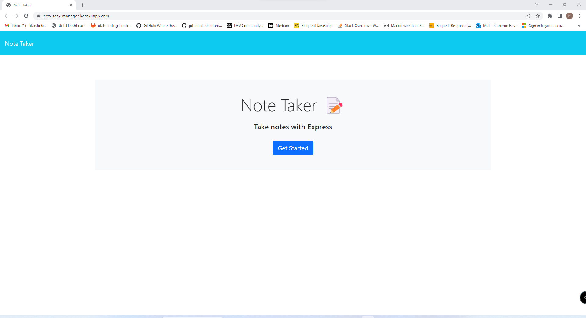
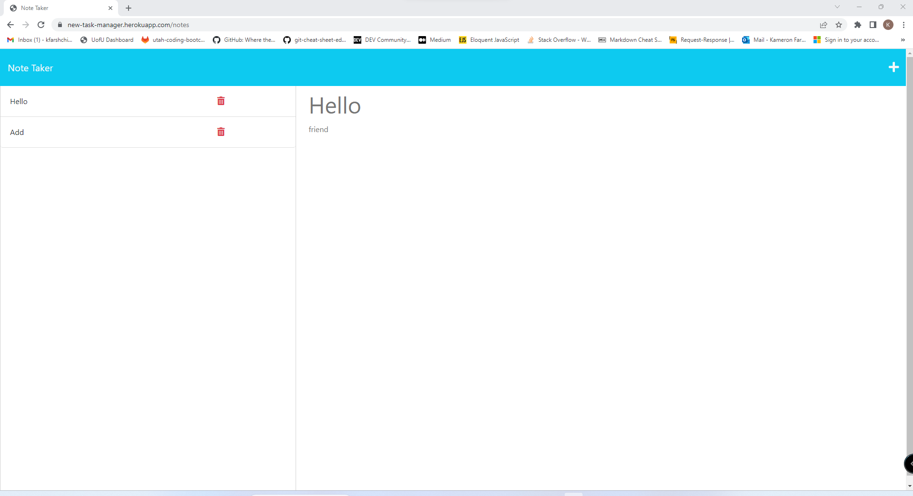

  # Task Manager

  ## License
  

  ## Description
  This application uses Express to save notes into the server database. It also uses UUID to add a key to the notes and allows the notes to be deleted from the database when the delete button sends the UUID id back to the database with the delete request. 

  ## Table of Contents
  - [License](#License)
  - [Description](#Description)
  - [Installation](#installation)
  - [Usage](#Usage)
  - [Credits](#credits)
  - [Tests](#Tests)
  - [Questions](#Questions)
  
  ## Installation
  - npm i express
  - npm i uuid

  ## Usage
  
  
  
  A simple application you can use to save notes and have access them anywhere at any time. 
  
  ## Credits
  na

  ## Tests
  na

  ## Questions
  If you would like to ask me any questions. Contact me at my email address below or you can check out my Github profile.
  - Email-kfarshchian@gmail.com
  - Github user name- kfarshchian
  
  
